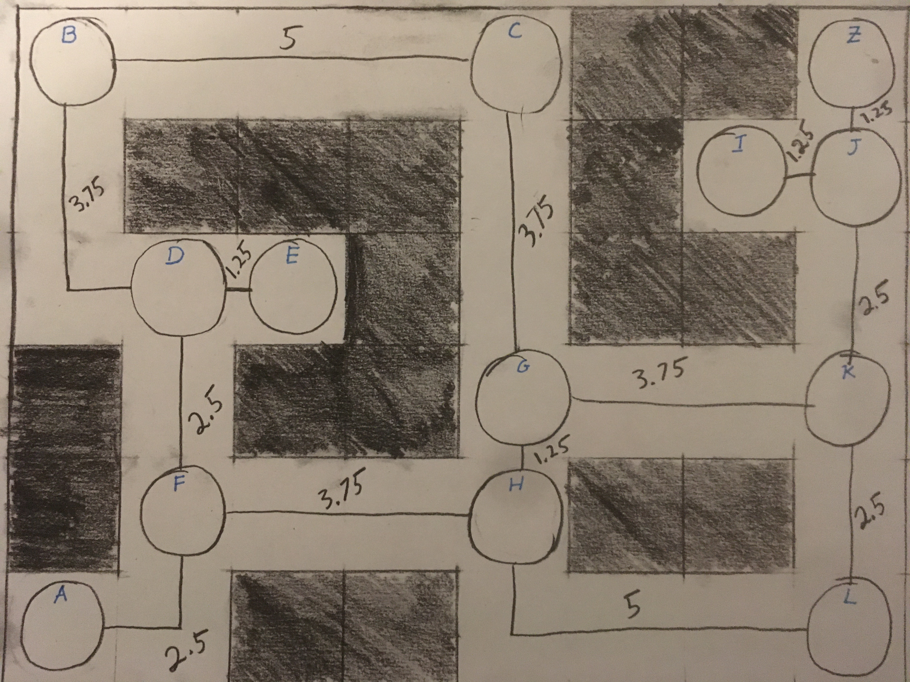
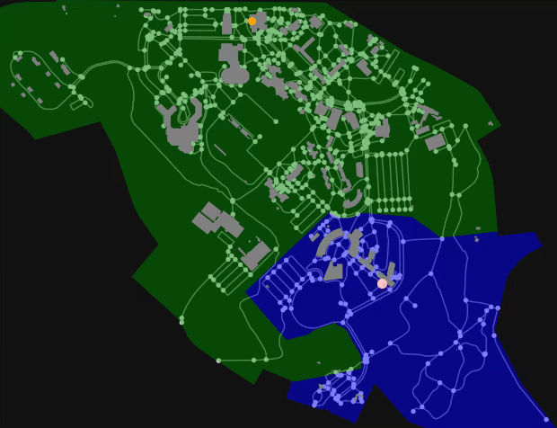

# Visualizing A\*

An animation of walking from East Hall at Olin College to Olin Hall at Babson
College:

## Introduction

The A\* algorithm is an extension of [Dijkstra's algorithm](../dijkstra/). The
extension is in the form of a heuristic function, $h(n)$, which estimates the
distance from any given node $n$ to the destination node. A\* is primarily
useful in applications where there is an easy heuristic function: for example,
in a mapping program we can use the [great circle
distance](https://en.wikipedia.org/wiki/Great-circle_distance) to estimate the
distance between two (lon, lat) points on Earth.

The heuristic function comes into play when choosing which node to process
next. In Dijkstra's algorithm, we pick the unvisited node with the shortest
known path from the start node. In A\*, pick the node with the smallest sum of
the known distance from the start node to the estimated distance:

$$
\text{min}\left(\{\text{distance}(start, v) + h(v) | v \in V \} \right)
$$

Once we select a node, we process it in the same way as Dijkstra's algorithm:
mark the node as visited (or remove it from unvisited) and update the shortest
path for all adjacent nodes.

We continue the algorithm until the destination node has been marked as visited.

## A Visual Walkthrough

Consider trying to get from node A to node Z in the following maze:

Distances are specified in inches.

We can say that we know the distance from A to A (0). We can use a ruler as our
heuristic function to estimate the distance from A to Z: (10.75):

Unmarked distances represent a length of infinity.

The shortest combined known distance and heuristic distance is node A at 10.75.
We will process this node.

We look at all adjacent nodes and mark update their known distance from A, the
shortest path from A, and the heuristic:

Then, we can mark A as visited.

Out of the unvisited nodes, node F has the shortest combined known and
heuristic distance (11.5):

We update the known shortest paths to the adjacent nodes and their heuristics:

Then we mark F as visited:

This process continues until we find the shortest path from A to Z:

## Comparison with Dijkstra

The heuristic makes A\* behave similar to Dijkstra's algorithm, but instead of
branching out in all directions it is biased in the direction it needs to head.
Unfortunately, A\* is not always applicable, because in some systems there is
no way to estimate the how far a node is from a destination node.

A visualization of A\* (top) vs Dijkstra's (bottom) walking from Olin College's
East Hall to Babson College's Olin Hall:

## Notes:

Visualizations are created with the `visualize.py` script. It dumps out all the
frames as `jpg` files in a directory called `frames` relative to where the
script was run from.

Required Python packages are listed in `requirements.txt`, install with `pip
install -r requirements.txt`

## Libraries and References

### Libraries

- [NetworkX](https://networkx.org/)
- [OSMnx](https://osmnx.readthedocs.io/en/stable/)
- [Geopandas](https://geopandas.org/en/stable/)
- [Shapely](https://shapely.readthedocs.io/en/stable/manual.html)

### References

Boeing, G. 2017. [OSMnx: New Methods for Acquiring, Constructing, Analyzing,
and Visualizing Complex Street
Networks](https://geoffboeing.com/publications/osmnx-complex-street-networks/).
*Computers, Environment and Urban Systems* 65, 126-139.

Wikipedia Contributors. 2023. [A* Search
Algorithm](https://en.wikipedia.org/wiki/A*_search_algorithm). Wikipedia, The
Free Encyclopedia

Wikipedia Contributors. 2023. [Dijkstra's
Algorithm](https://en.wikipedia.org/wiki/Dijkstra%27s_algorithm). Wikipedia,
The Free Encyclopedia
