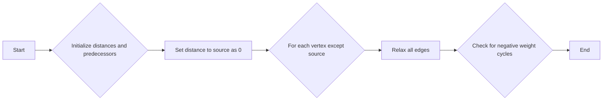
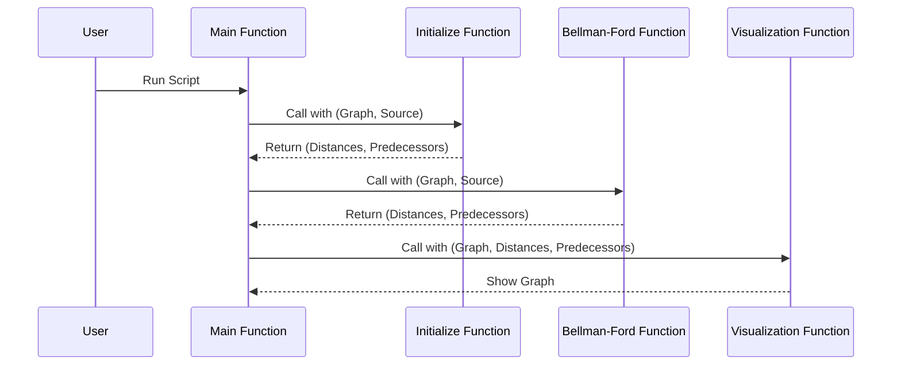

# Bellman-Ford Algorithm

## Overview

The Bellman-Ford algorithm is a fundamental algorithm in computer science used for finding the shortest paths from a single source vertex to all other vertices in a weighted graph. It is particularly notable for its ability to handle graphs with negative weight edges, unlike Dijkstra's algorithm.

### Key Features
- **Handles Negative Weights:** Can process graphs with negative weight edges and detect negative weight cycles.
- **Versatility:** Useful in various applications such as routing protocols and currency exchange.

## Algorithm Pseudo-Code

The Bellman-Ford algorithm follows this high-level pseudo-code (and accompanying graph):

```python
for v in V:
    v.distance = infinity
    v.predecessor = None
source.distance = 0
for i from 1 to |V| - 1:
    for (u, v) in E:
        relax(u, v)
```



## Implementation

### Initialization

The initialization of the Bellman-Ford algorithm sets up the distances and predecessors for each vertex:

```python
def initialize(graph, source):
    distance = {node: float('infinity') for node in graph}
    predecessor = {node: None for node in graph}
    distance[source] = 0
    return distance, predecessor
```

### Graph Visualization

The implementation includes visual representation using `networkx` and `matplotlib`. Here's a snippet to create a sample graph:

```python
import networkx as nx
import matplotlib.pyplot as plt

G = nx.DiGraph()
nodes = ["A", "B", "C", "D"]
G.add_nodes_from(nodes)
edges = [("A", "B", 1), ("B", "C", 2), ("A", "C", 5), ("C", "D", -3)]
G.add_weighted_edges_from(edges)

# Visualization code...
```

**Note:** You can add an example image of the graph here. This helps in better understanding how the graph looks after plotting.

### Sequence Diagram for Function Calls



## Usage

To run the Bellman-Ford algorithm:

1. **Install Dependencies:**
   ```bash
   pip install networkx matplotlib
   ```

2. **Run the Script:**
   Use the interactive Jupyter Notebook to explore the explanation and implementation of the Bellman-Ford Algorithm. There are sample implementations, modifiable graphs for running the algorithm on, path tracing functionality, an interactive step-by-step pseudo-code-based visualizer, execution time comparisons and visualizations, and a nice multiple-choice quiz at the end to help reinforce all that knowledge!

## Applications and Limitations

### Applications
- **Network Routing**
- **Currency Arbitrage Detection**

### Limitations
- **Performance:** Slower than Dijkstra's algorithm for graphs without negative weight edges due to its time complexity of \(O(VE)\).

## Conclusion

The Bellman-Ford algorithm is a versatile tool in the realm of graph algorithms, crucial for understanding complex networked systems and their behaviors.

---
